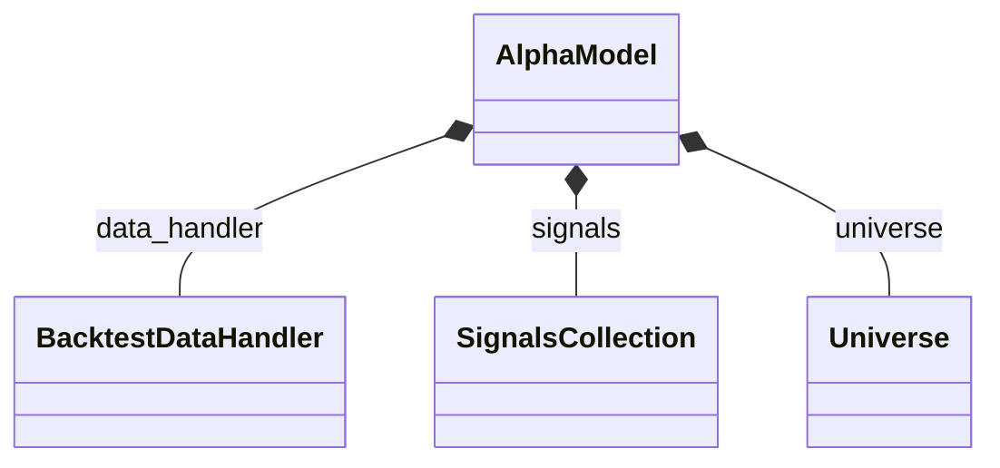
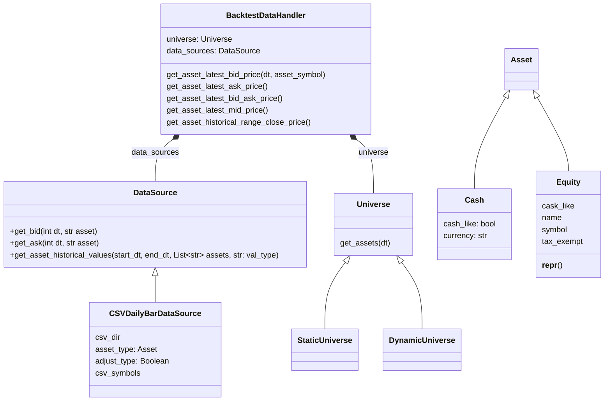
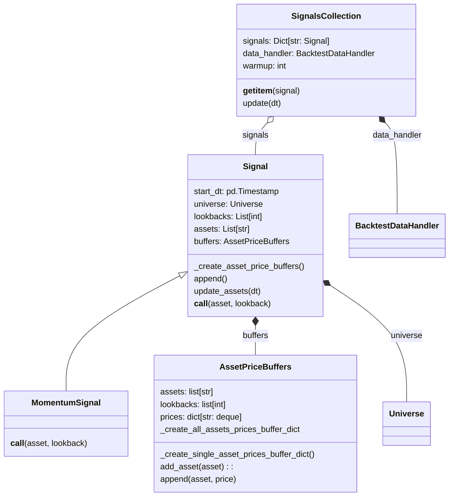
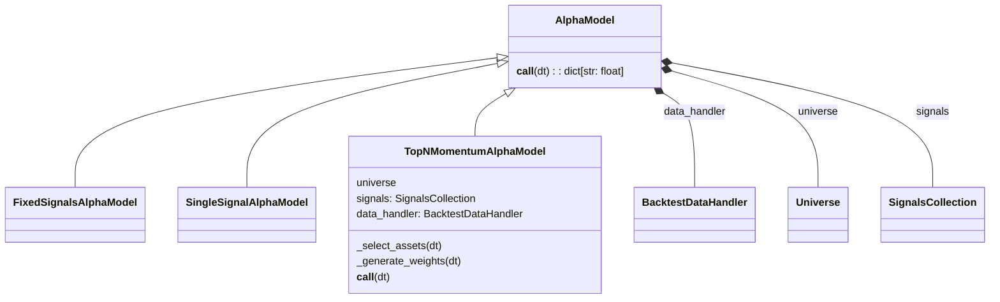

# 模组简介

对于一个事件驱动的交易系统而言, 每天产生的四类事件分别是, MarketEvent, SignalEvent, OrderEvent, FillEvent

考虑到模组数量过多，所以我按照功能大致将其分解为4类。本节是第一部分, 大致介绍了金融市场以及策略的结构。本节的终极目的是构建`BacktestDataHandler`以及`AlphaModel`, 也就是
处理MarketEvent以及SignalEvent.



## data & asset

data是qstrader中用于数据管理的module. 它由`DataSource`和`BacktestDataHandler`组成。
其中`DataSource`用于从不同数据源读取数据, 而`BacktestDataHandler`则用于获取数据。



??? abstract "StaticUniverse"
    === "asset_list"
        ``` py
        ['EQ:SPY','EQ:XLE']
        ```
    === "get_assets"
        ``` py
        def get_assets(self, dt):
            return self.asset_list
        ```
??? abstract "BacktestDataHandler"
    === "get_asset_latest_bid_price"
    === "get_asset_latest_ask_price"
    === "get_asset_latest_bid_ask_price"
    === "get_asset_latest_mid_price"
    === "get_assets_historical_range_close_price"
        ``` py
        def get_assets_historical_range_close_price(
            self, start_dt, end_dt, asset_symbols, adjusted=False
        ):
            prices_df = None
            for ds in self.data_sources:
                try:
                    prices_df = ds.get_assets_historical_closes(
                        start_dt, end_dt, asset_symbols, adjusted=adjusted
                    )
                    if prices_df is not None:
                        return prices_df
                except Exception:
                    raise
            return prices_df
        ```
从源码中可以发现, BacktestDataHandler只是一个封装的接口罢了. 

!!! caution
    虽然这个结构看起来可以支持多个数据源, 但事实上其它数据源只是备选。以后尽量只使用一个数据源, 并且放入List里

## signals



??? abstract "AssetPriceBuffers"
    === "prices"
        ```py
        {'EQ:XLB_127': deque([]), 'EQ:XLE_127': deque([]), 'EQ:XLF_127': deque([]), 'EQ:XLI_127': deque([]), 'EQ:XLK_127': deque([]), 'EQ:XLP_127': deque([]), 'EQ:XLU_127': deque([]), 'EQ:XLV_127': deque([]), 'EQ:XLY_127': deque([])}
        ```
    === "add_asset(asset)"
        prices是一个字典, 相当于prices.update(dict)
    
    === "append(asset, price)"
        在deque里append一个新的price进去，特别关注一下append调用的时刻

如果说DataHandler存储了历史所有的数据, 那么signal里的`AssetPriceBuffers`则用于缓存计算信号所需要的信息.
AssetPriceBuffers里最重要的一个attribute是`prices`, 他是一个字典, key大约是`"EQ:000001.XSHE_30"`这种结构。

之所以提到数据缓存器, 是因为接下来一个重要的类`Signal`会用到缓存的数据计算信号。值得注意的是，我们提到的信号，通常有

1. 辅助交易的信号: 这时候信号通常是某种"score"
2. 交易的信号: 这时候通常是一种条件
3. 目标权重

你应当根据具体语境来区别不同的"信号"

??? abstract "Signal"
    === "append(asset, price)"
        ```py
        def append(self, asset, price):
            self.buffers.append(asset, price)
        ```
        直接执行self.buffers.append(asset, price)

    === "update_assets(dt)"
        ``` py
        def update_assets(self, dt):

        universe_assets = self.universe.get_assets(dt)
        extra_assets = list(set(universe_assets) - set((self.assets)))
        for extra_asset in extra_assets:
            self.assets.append(extra_asset)
        ```
        从universe中获取资产池并{--扩充--}(我目前觉得这个不太合理)
    
    === "\_\_call\_\_"
        ``` py
        def __call__(self, asset, lookback):
            return score
        ```
        return 一个 得分


`Signal`的集合便是`SignalsCollection`, 
??? abstract "SignalsCollection"
    === "\_\_getitem\_\_(signal: str)"
        ``` py
        def __getitem__(self, signal):
            return self.signals[signal]
        ``` 
        利用getitem可以利用类似于字典索引的syntax得到单独的信号类

    === "update(self, dt)"
        ``` py
        def update(self, dt):
            for name, signal in self.signals.items():
                self.signals[name].update_assets(dt)
                
            for name, signal in self.signals.items():
                assets = signal.assets
                for asset in assets:
                    price = self.data_handler.get_asset_latest_mid_price(dt, asset)
                    self.signals[name].append(asset, price)
            self.warmup += 1
        ```

SignalsCollection的update方法会从DataHandler中取当前时刻的数据, 并将其append到缓存的deque里.

> 值得注意的是, 这里的self.signals仅仅只是字典, 而后文的signals通常则是指SignalsCollection这个类


## alpha_model

SignalsCollection主要为AlphaModel提供决策信息. AlphaModel通常是我们自己写的, 通常实现一个新的策略时, 需要写一个Signal的子类以及AlphaModel的子类.

!!! note
    AlphaModel会根据信号(得分)输出权重



??? abstract "TopNMomentumAlphaModel"
    === "_select_assets"
        ``` py
        def _highest_momentum_asset(self, dt):
            assets = self.signals['momentum'].assets
            all_momenta = {
                asset: self.signals['momentum'](
                    asset, self.mom_lookback
                ) for asset in assets
            }
            return [
                asset[0] for asset in sorted(
                    all_momenta.items(),
                    key=operator.itemgetter(1),
                    reverse=True
                )
            ][:self.mom_top_n]
        ```

    === "\_generate_weights"
        ``` py
        def _generate_weights(self, dt):
            assets = self.universe.get_assets(dt)
            weights =  {asset: 0.0 for asset in assets}
            top_assets = self._select_assets(dt)
            
            if self.signals.warmup >= self.mom_lookback:
                for asset in top_assets:
                    weights[asset] = 1.0 / self.mom_top_n
            return weights
        ```

    === "\_\_call\_\_(dt)"
        ``` py
        def __call__(self, dt):
            reutrn self._generate_weights(dt)
        ```

