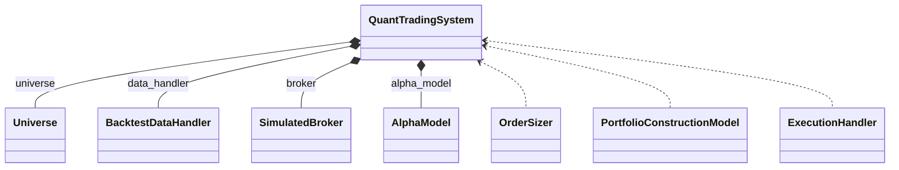

# 模组简介

在第二, 三部分, 我们主要介绍账户, 订单管理. 在本部分, 我们最终目的是构建`QuantTradingSystem`.
根据事件驱动的交易系统的运行顺序, 本节应当介绍OrderEvent.

```mermaid
classDiagram
    QuantTradingSystem *-- Universe: universe
    QuantTradingSystem *-- BacktestDataHandler: data_handler
    QuantTradingSystem *-- SimulatedBroker: broker
    QuantTradingSystem *-- AlphaModel: alpha_model
    QuantTradingSystem <.. OrderSizer
    QuantTradingSystem <.. PortfolioConstructionModel
    QuantTradingSystem <.. ExecutionHandler
```

因此, 本节将重点关注`OrderSizer`以及`PortfolioConstructionModel`.
