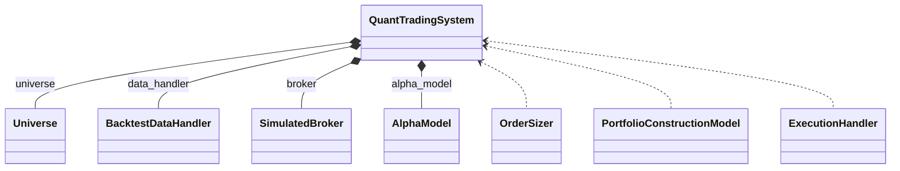
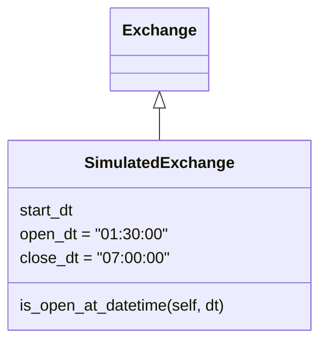
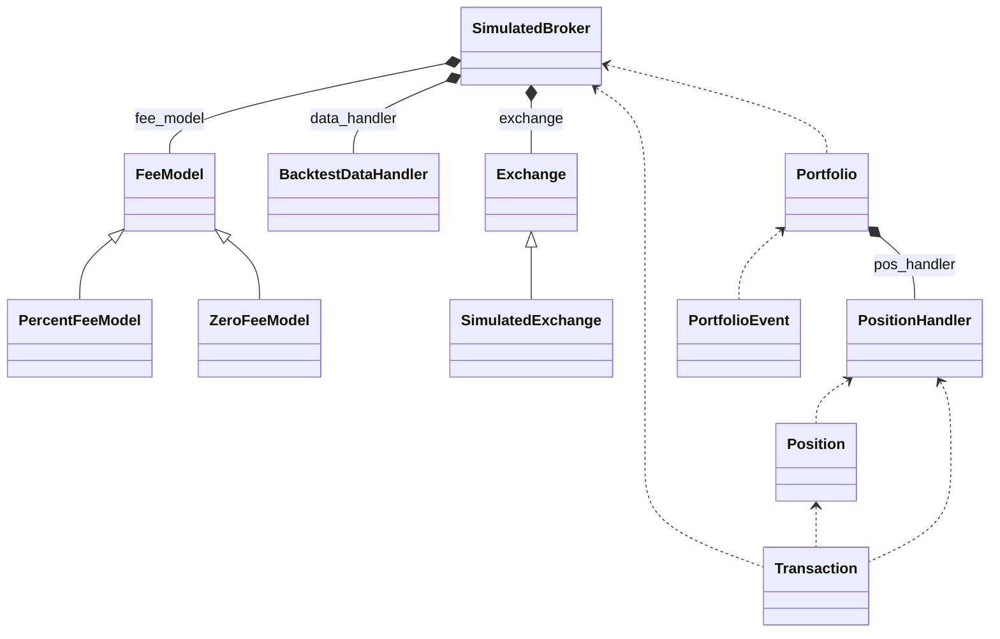
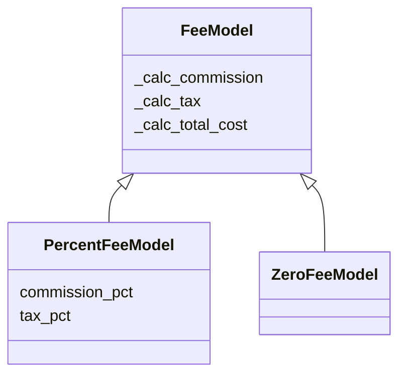
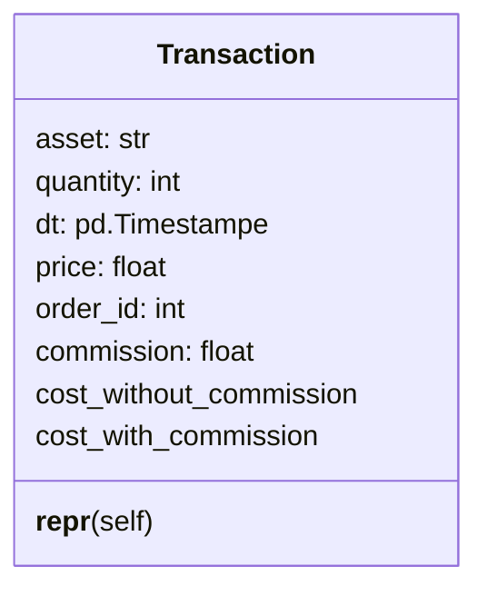
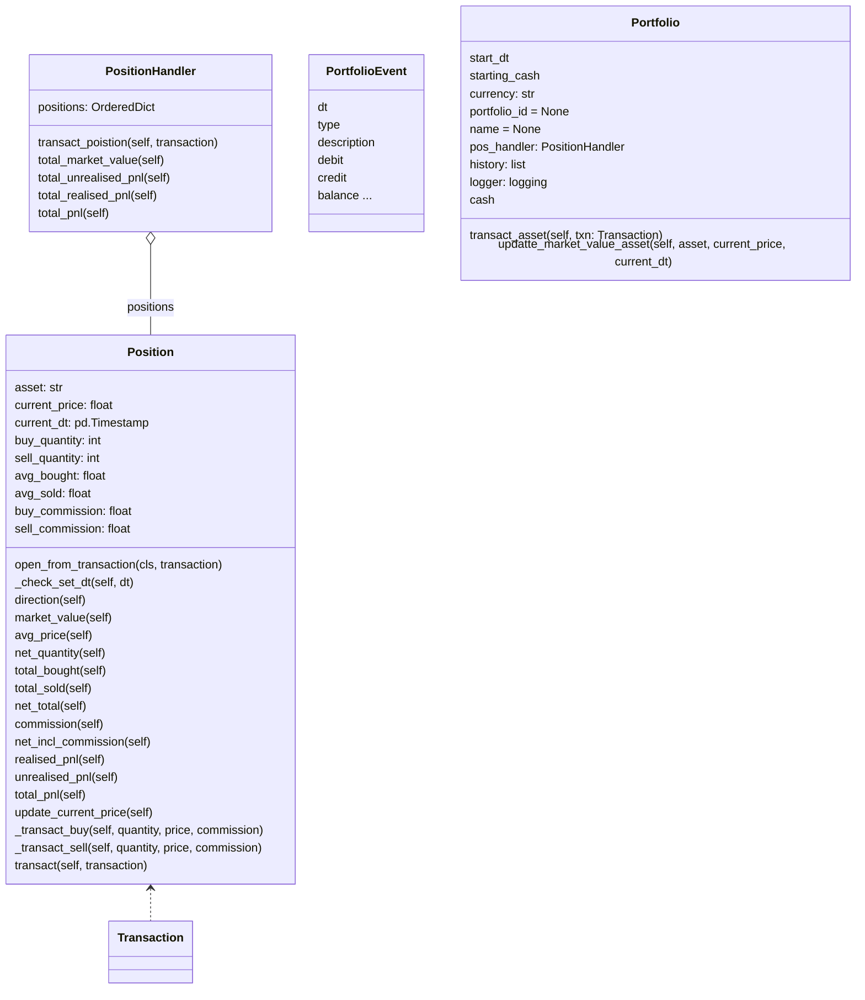

# 模组简介

在第二, 三部分, 我们主要介绍账户, 订单管理. 在本部分, 我们最终目的是构建`QuantTradingSystem`



我们首先着手于`SimulatedBroker`, 它是用于资产管理的类, 主要调用的时间在每天开盘后. 把订单的信息转换为交易的信息，进而更新账户信息。

## exchange

用于模拟交易所, 里边大致有开收盘的时间信息.



!!! abstract "SimulatedExchange"
    ``` py
    def is_open_at_datetime(self, dt):
        if dt.weekday() > 4:
            return False
        return self.open_dt <= dt.time() and dt.time() < self.close_dt
    ```

当然目前的这个判断方式是有问题的, 后边有空了改进一下.

## broker



### broker.fee_model

费用模型本质上就是封装了几个计算费用的函数, 需要传入资产的名字, 数量， consideration. 



??? abstract "fee_model"
    === "PercentFeeModel"
        ```py
        from qstrader.broker.fee_model.fee_model import FeeModel

        class PercentFeeModel(FeeModel)
            def __init__(self, commission_pct=0.0, tax_pct=0.0):
                super().__init__()
                self.commission_pct = commission
                self.tax_pct = tax_pct

            def _calc_commission(self, asset, quantity, consideration, broker=None):
                return self.commission_pct * abs(consideration)
            
            def _calc_tax(self, asset, quantity, consideration, broker=None):
                return self.tax_pct * abs(consideration)
            
            def _calc_total_cost(self, asset, quantity, consideration, broker=None):
                commission = self._calc_commission(asset, quantity, consideration, broker)
                tax = self._calc_tax(asset, quantity, consideration, broker)
                return commission + tax
        ```
    === "ZeroFeeModel"
        ```py
        from qstrader.broker.fee_model.fee_model import FeeModel

        ```

### broker.transaction

这个类也非常简单, 甚至简单到不知道为什么要去封装. 直接把交易费用和成本加起来不就行了?   



??? abstract "Transaction"
    ``` py title="transaction.py"
    class Transaction(object):

        def __init__(
            self,
            asset,
            quantity,
            dt,
            price,
            order_id,
            commission=0.0
        ):
            self.asset = asset
            self.quantity = quantity
            self.direction = np.copysign(1, self.quantity)
            self.dt = dt
            self.price = price
            self.order_id = order_id
            self.commission = commission

        def __repr__(self):

            return "%s(asset=%s, quantity=%s, dt=%s, " \
                "price=%s, order_id=%s)" % (
                    type(self).__name__, self.asset,
                    self.quantity, self.dt,
                    self.price, self.order_id
                )

        @property
        def cost_without_commission(self):
        
            return self.quantity * self.price

        @property
        def cost_with_commission(self):

            if self.commission == 0.0:
                return self.cost_without_commission
            else:
                return self.cost_without_commission + self.commission
    ```
值得注意的是Transaction类被调用的时间, 这里我列出一些回测信息供参考

=== "Transaction被调用的前后"
    ``` text
    (1999-12-31 07:00:00+00:00) - market_close
    (1999-12-31 07:00:00+00:00) - trading logic and rebalance
    (1999-12-31 07:00:00+00:00) - target weights: {'EQ:XLB': 0.0, 'EQ:XLE': 0.0, 'EQ:XLF': 0.0, 'EQ:XLI': 0.0, 'EQ:XLK': 0.3333333333333333, 'EQ:XLP': 0.0, 'EQ:XLU': 0.0, 'EQ:XLV': 0.3333333333333333, 'EQ:XLY': 0.3333333333333333}
    (1999-12-31 07:00:00+00:00) - submitted order: EQ:XLK, qty: 8017
    (1999-12-31 07:00:00+00:00) - submitted order: EQ:XLV, qty: 15149
    (1999-12-31 07:00:00+00:00) - submitted order: EQ:XLY, qty: 14116
    (2000-01-03 01:30:00+00:00) - market_open
    Backend MacOSX is interactive backend. Turning interactive mode on.
    ```
=== "Trasaction内部信息"
    ``` py
    self.quantity
    8017
    self.direction
    1.0
    self.dt
    Timestamp('2000-01-03 01:30:00+0000', tz='UTC')
    self.price
    41.01966094970703
    self.order_id
    '7855a32a1b9a42d1891b6caefd1ae9f2'
    ```

这说明订单管理部分是在收盘之后, 而资产组合的变换是在开盘之后. 

### broker.portfolio

portfolio里分为Position, PositonHandler, PortfolioEvent, Portfolio



这个包就比较难了, 需要详解拆解. 首先是仓位管理的类, `Position`.

Position是针对一个资产而言的, 如果想真正理解Position的使用情况，则需观察PositionHandler的方法和属性

=== "Position的交易详情"
    ```py
    (2000-03-31 07:00:00+00:00) - market_close
    (2000-03-31 07:00:00+00:00) - trading logic and rebalance
    (2000-03-31 07:00:00+00:00) - target weights: {'EQ:XLB': 0.0, 'EQ:XLE': 0.3333333333333333, 'EQ:XLF': 0.0, 'EQ:XLI': 0.0, 'EQ:XLK': 0.3333333333333333, 'EQ:XLP': 0.0, 'EQ:XLU': 0.0, 'EQ:XLV': 0.3333333333333333, 'EQ:XLY': 0.0}
    (2000-03-31 07:00:00+00:00) - submitted order: EQ:XLE, qty: 20271
    (2000-03-31 07:00:00+00:00) - submitted order: EQ:XLK, qty: 180.0
    (2000-03-31 07:00:00+00:00) - submitted order: EQ:XLV, qty: 460.0
    (2000-03-31 07:00:00+00:00) - submitted order: EQ:XLY, qty: -15673
    (2000-04-03 01:30:00+00:00) - market_open
    (2000-04-03 01:30:00+00:00) - executed order: EQ:XLY, qty: -15673, price: 22.31, consideration: -349725.00, commission: 0.00, total: -349725.00
    ```

123

=== "PositionHandler的调用时间"

    ``` py
    Adjusting CSV file for symbol 'EQ:XLP'...
    Adjusting CSV file for symbol 'EQ:XLU'...
    Adjusting CSV file for symbol 'EQ:XLV'...
    Adjusting CSV file for symbol 'EQ:XLY'...
    Initialising simulated broker "Backtest Simulated Broker Account"...
    Backend MacOSX is interactive backend. Turning interactive mode on.
    ```
    在第一天开盘之前, PositionHandler就已经被实例化.

=== "更新情况"

    ``` py
    def transact_position(self, transaction):

        asset = transaction.asset
        if asset in self.positions:
            self.positions[asset].transact(transaction)
        else:
            position = Position.open_from_transaction(transaction)
            self.positions[asset] = position

        # If the position has zero quantity remove it
        if self.positions[asset].net_quantity == 0:
            del self.positions[asset]
    ```

关于PortfolioEvent, 首先它会在第一天开盘前往券商订阅资金。更严谨的说, 在`BacktestTradingSession` instantiate的时候, 会调用一个函数_create_broker, 这时候就用到了PortfolioEvent. 

最后是`Portfolio`, 它在开始回测时被instantiate, 然后后边

## broker.SimulatedBroker