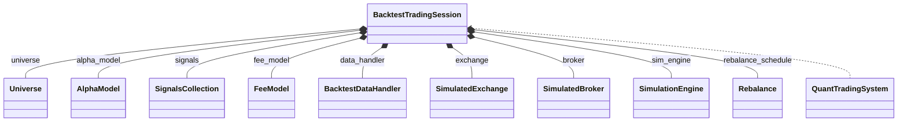

# 模组介绍

在第三部分, 我们的目的是结合一二部分的成果, 构建回测系统.

```mermaid
classDiagram
    BacktestTradingSession *-- Universe: universe
    BacktestTradingSession *-- AlphaModel: alpha_model
    BacktestTradingSession *-- SignalsCollection: signals
    BacktestTradingSession *-- FeeModel : fee_model
    BacktestTradingSession *-- BacktestDataHandler: data_handler
    BacktestTradingSession *-- SimulatedExchange: exchange
    BacktestTradingSession *-- SimulatedBroker: broker
    BacktestTradingSession *-- SimulationEngine: sim_engine
    BacktestTradingSession *-- Rebalance: rebalance_schedule
    BacktestTradingSession <.. QuantTradingSystem
```

接下来开始介绍不同的节点(nodes)

## 测试